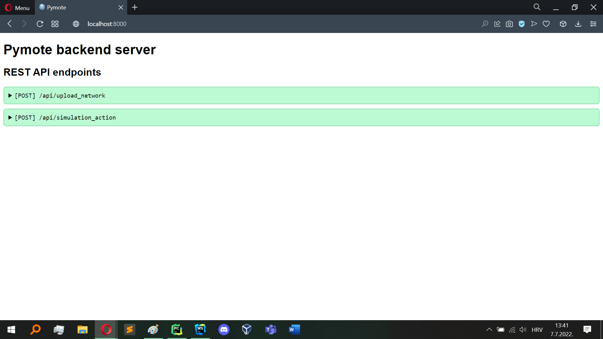

# pymote_backend

## Installation

Requirements:
- Python 2.7
- [Pymote](https://pymote.readthedocs.io/en/latest/install/installation.html)

OPTIONAL Create and activate a [virtual environment](https://virtualenv.pypa.io/en/latest/index.html).
```
pip install Django==1.11
pip install django-cors-headers==3.0.2
pip install django-environ==0.4.5
pip install djangorestframework==3.9.4
```

## Starting the server
```
python manage.py migrate
python manage.py runserver
```
The backend server is listening at http://localhost:8000/. Open the link in the browser to see the API documentation.

